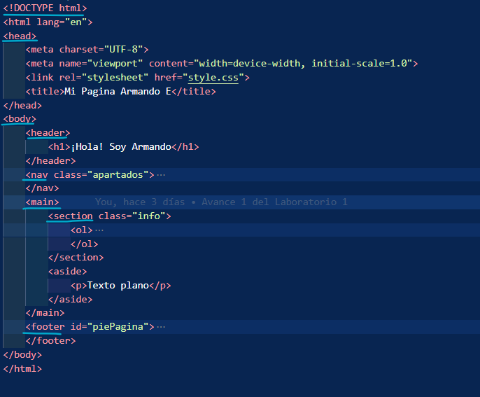
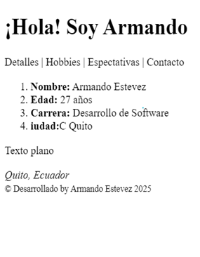
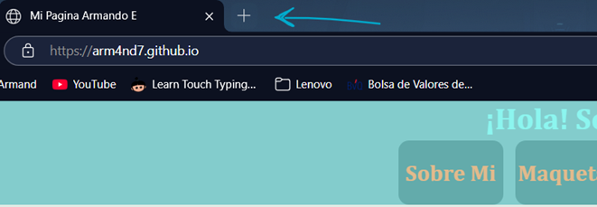
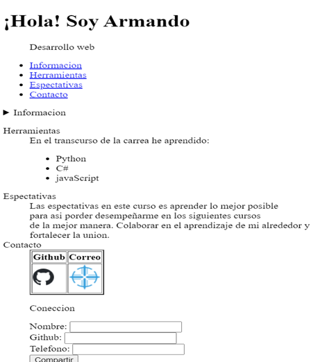
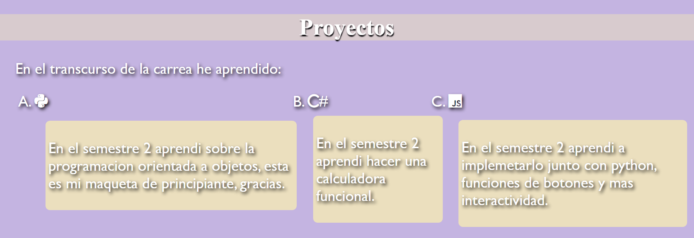
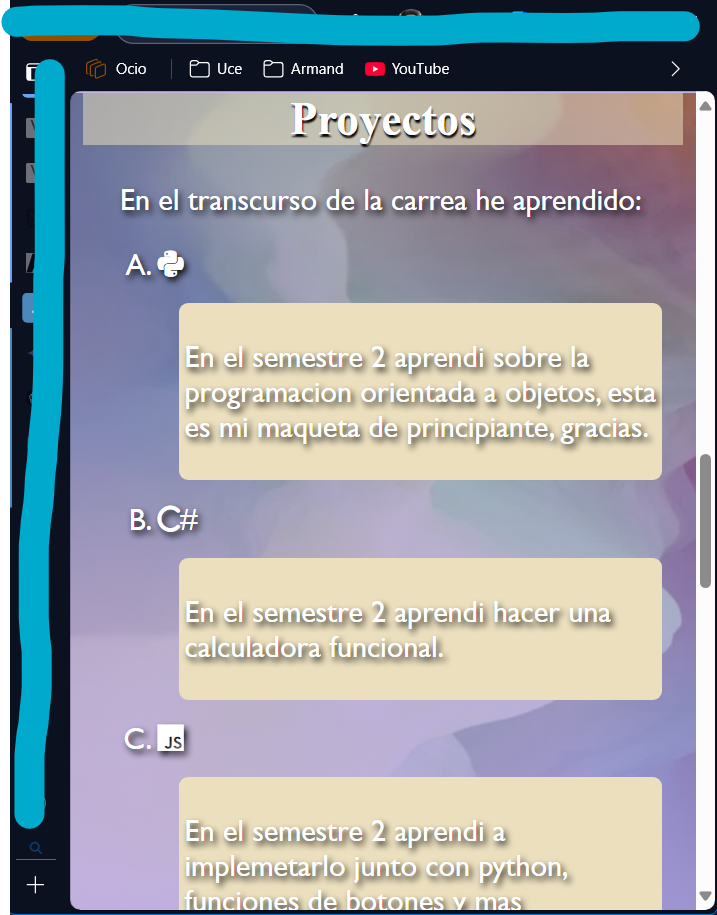

# lab1DesarrolloWeb3.github.io

# **✅ Mi Pagina Web **
---
Bienvenido a mi página web.
En este apartado te indico como avancé en mi página web.
Antes debo mencionarte que: usé lo mas básico en desarrollo web, sin más que comentar, empecemos.
---
# 📌 **Indice**
1. **Estructura**
2. **Etiquetas**
3. **`VARIADO` Estilos** 
4. **`MEDIA` Próximo a responsive**
---

# **1. ESTRUCTURA**
Comence con la estructura.
Me basé en la estructura básica para poder realizar el documento html.
Respetando la indentación y la importancia de cada etiqueta.

DOCTYPE

->HTML

->HEAD

->BODY

		->HEADER

		->NAV

		->MAIN

			->SECTION

		->FOOTER
    

#### Figura 1(Estructura html)

En la web se puede visualizar asi:

#### Figura 2(Previa de la página web)

# **2. ETIQUETAS**
Las etiquetas más importantes fueron presentadas en el anterior apartado, aun así, dentro de cada una de esas etiquetas padre, se encuentran etiquetas que proporcionan información sobre la página web, así, usamos la etiqueta title para poder ubicar el nombre de nuestra página web en las pestañas de los navegadores.

#### Figura 3 (Título de nuestra página web)

Entre otras de las etiquetas usadas están:
p, ul, ol, nav, label, img, y otros pocos.
La razón de usar estas etiquetas es para ingresar información, listado e imágenes.

Uno de esos usos se puede ver en la Figura 2, usé la etiqueta h1 para poder darle un título de ingreso a la vista de la página Web. De esta forma se usó las etiquetas mencionadas de forma que se pueda organizar y estilizar la página web.

#### Figura 4(Uso de etiquetas adicionales.)

# **3.ESTILOS**

En este apartado realizo el documento CSS, uso selectores de clase, tipo, y combinados.
Me llevó mucho tiempo intentar como quedaba cada uno, al final dejé un una muestra de fondos y con algunos hover para que se de un poco de color.

#### Figura 5(Uso de selector hover)

En el apartado de las dimensiones si me tomó tiempo usarlos ya que varian en cada uno.

En algunas de las etiquetas tomé de referencia seguir estos criterios.

-	em -> espaciado escalable de acuerdo con la etiqueta padre.
o	padding…
-	rem -> espaciado global de acuerdo con la etiqueta raíz.
o	tamaño fuente…
-	% -> proporcional al contenedor padre.
o	Ancho, alto ….
-	px -> tamaño fijo y exacto.
o	Bordes…

Cabe recalcar que para mantener el diseño, en algunas etiquetas no se sigue este criterio.

Otros aspectos para considerar son los colores, en este caso se trató de usar colores en los hover e imágenes de fondo para darle un aspecto mas cómodo. Tal como se muestra en la Figura 5, el uso del hover para que el puntero muestre la imagen y padding de las etiquetas.

Para mi caso use color morado, amarillo y blanco, cada en su especificación  #b9a6dbd7 ,  #ebdfbe88 y white.
quedando un tono de esta forma 

#### Figura 6(Uso de colores)

# **3.Proximo a responsive**

Este apartado lo llamé así ya que uso la herramienta @media que permite cambiar de dimensiones además de poner mas estilos cuando se lleva a una escala diferente.

#### Figura 7(tamaño pequeño)

#### Figura 8(tamaño grande)

A travez de todo esto te presento todo mi desarrollo.
# 🧑‍💻 Puedes revisarlo en 
https://arm4nd7.github.io/laboratorio-1-web-personal-Arm4nd7/